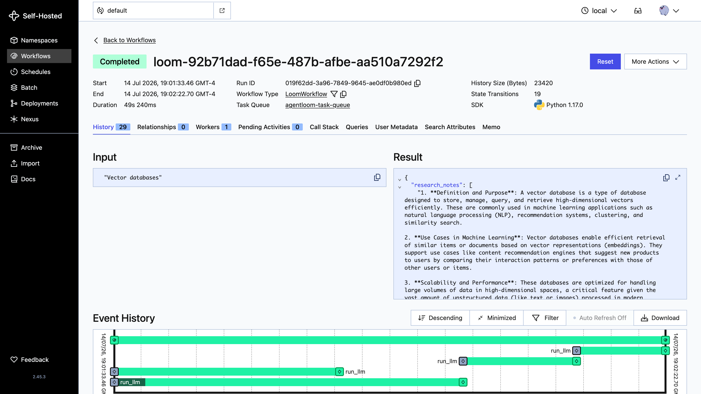
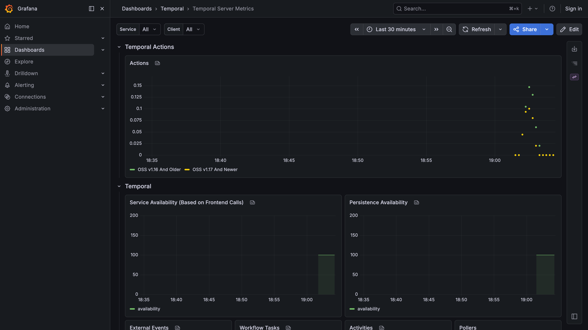
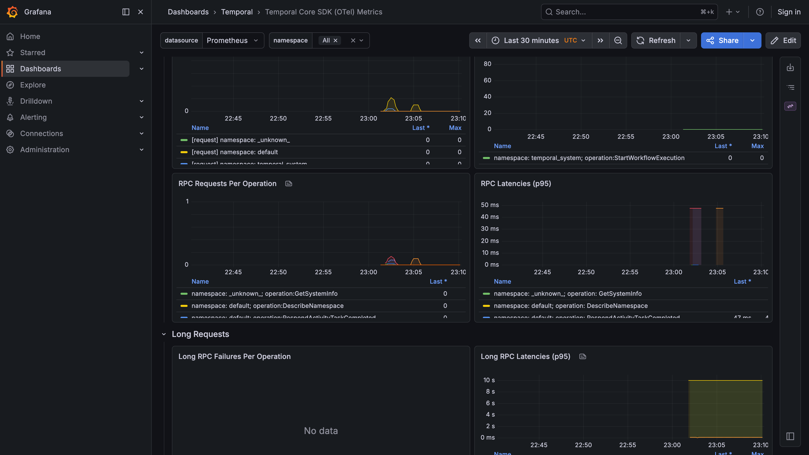
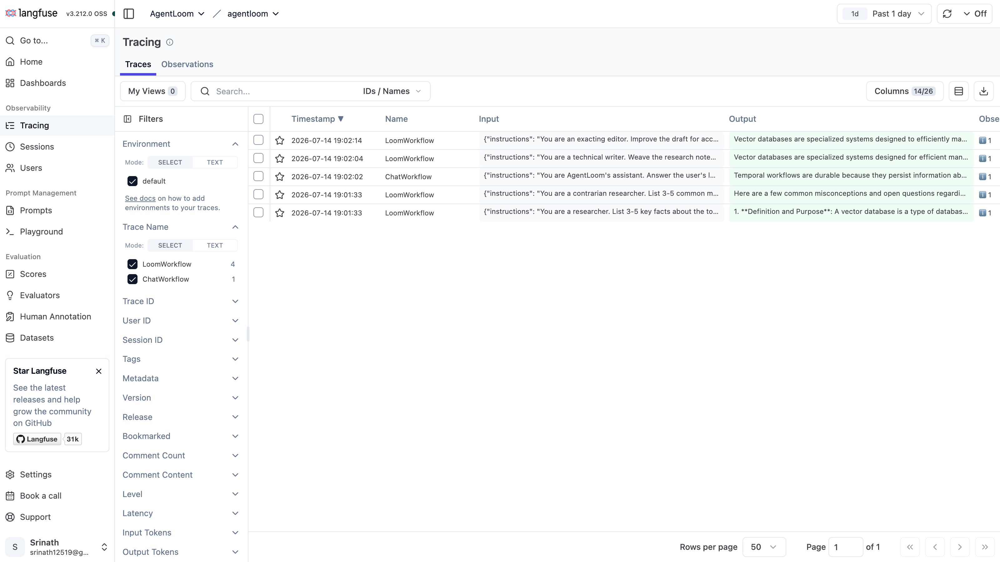
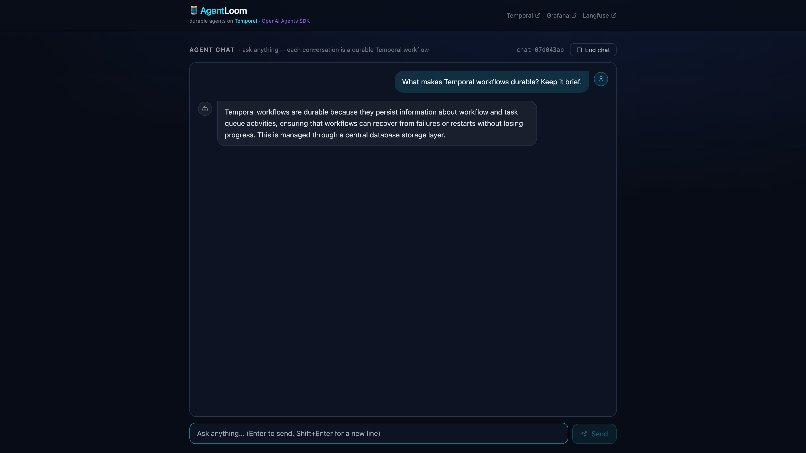

# 🧵 AgentLoom

**Durable multi-agent workflows, woven together with [Temporal](https://temporal.io).**

A loom weaves independent threads into one fabric. AgentLoom does the same with
LLM agents: each agent is a thread, Temporal is the loom, and the workflow is the
fabric — durable, resumable, and observable. If a worker crashes mid-pipeline,
execution resumes exactly where it left off. No lost LLM calls, no duplicate spend.

```
                ┌──────────────────┐
        ┌──────▶│ Researcher (facts)│──┐
 topic ─┤       └──────────────────┘  ├──▶ Writer ──▶ Critic ──▶ final brief
        │       ┌──────────────────┐  │
        └──────▶│ Researcher       │──┘
                │ (misconceptions) │
                └──────────────────┘
```

LLM calls go through any OpenAI-compatible endpoint —
[OpenRouter](https://openrouter.ai) by default, or a local server like Ollama.
Every call is traced ([Langfuse](https://langfuse.com)), every execution is
measured ([Prometheus](https://prometheus.io) + [Grafana](https://grafana.com)),
and the whole local stack is one command via [Flox](https://flox.dev).

## Capabilities at a glance

Everything below starts with a single `flox activate --start-services`. Each
capability has a deeper reference doc under [docs/services/](docs/README.md#per-service-reference).

| Capability | Service(s) | Where | Docs |
|---|---|---|---|
| Durable execution | Temporal dev server | gRPC `:7233` · Web UI <http://localhost:8233> · metrics `:9091` | [temporal.md](docs/services/temporal.md) |
| Agent workflows | `worker` (hosts all workflows + activities) | metrics `:9464`, logs to `$FLOX_ENV_CACHE/worker.log` | [worker.md](docs/services/worker.md) · [workflows.md](docs/services/workflows.md) |
| LLM calls | shared LLM activity → any OpenAI-compatible endpoint | OpenRouter by default, or Ollama via `LLM_BASE_URL` | [activities.md](docs/services/activities.md) |
| Chat UI | `api` (FastAPI) + `frontend` (React/Vite) | API `:8000` · UI <http://localhost:5173> | [workflows.md](docs/services/workflows.md) |
| Sandboxes | `agentloom.sandbox` (local Docker or E2B) | runs inside workflows | [sandbox.md](docs/services/sandbox.md) |
| Metrics | Prometheus | <http://localhost:9090> | [prometheus.md](docs/services/prometheus.md) |
| Dashboards | Grafana (auto-provisioned) | <http://localhost:3000> | [grafana.md](docs/services/grafana.md) |
| Logs | Loki + Grafana Alloy | Loki `:3100` · Alloy UI `:12345` | [loki.md](docs/services/loki.md) |
| LLM tracing | Langfuse (self-hosted, Docker Compose) | <http://localhost:3001> | [langfuse.md](docs/services/langfuse.md) |
| Agent evals | [agent-evals](https://github.com/Srinath279/agent-evals) library (`evals/` configs) | `uv run evals run --config evals/loom_brief.yaml` · scores & rubrics in Langfuse | [evals.md](docs/services/evals.md) |
| Local env & services | Flox (process-compose) | `flox services status` | [flox.md](docs/services/flox.md) |
| Kubernetes deploy | Kustomize base + dev/prod overlays | `deploy/k8s/` | [kubernetes.md](docs/deployment/kubernetes.md) |

### Temporal — durable execution

Temporal is the "loom": every workflow step is persisted as an append-only
event history, so if a worker dies mid-pipeline (crash, deploy, OOM), a
reconnecting worker replays the history and resumes at exactly the next
undone step — no lost or duplicated LLM calls. Locally it runs as the
single-binary dev server with state in SQLite
(`$FLOX_ENV_CACHE/temporal.db`), so workflows survive service restarts too.
Watch any run live in the Web UI at <http://localhost:8233>: inputs, outputs,
retries, and timing for every activity.



### Workflows & agents

Four workflows ship today, all hosted by the one worker process:

- **`LoomWorkflow`** — the flagship pipeline: two researcher agents run in
  parallel (facts + misconceptions), then a writer drafts a brief, then a
  critic edits it. Submit one with `uv run python -m agentloom.cli "<topic>"`.
- **`ChatWorkflow`** — durable interactive chat: messages arrive as Temporal
  signals, the transcript is workflow state, so conversations survive page
  reloads and worker crashes.
- **`SandboxDemoWorkflow`** — demonstrates running shell commands in an
  ephemeral sandbox from workflow code.
- **`HelloWorld`** — the minimal smoke-test workflow.

An agent is just an `AgentSpec` (name + instructions + optional model
override) in [catalog.py](src/agentloom/agents/catalog.py); every agent runs
through the same generic LLM activity, and Temporal's retry policy — not SDK
retry loops — owns backoff and recovery.

### Sandboxes — ephemeral compute

Workflows can run shell commands in isolated, durable sandboxes
([agentloom.sandbox](src/agentloom/sandbox/__init__.py)) backed by local
Docker or [E2B](https://e2b.dev), with suspend/resume and snapshot/fork. It's
a Python port of Temporal's
[sandbox-orchestration-harness](https://github.com/temporal-community/sandbox-orchestration-harness).

### Prometheus — metrics

Prometheus scrapes Temporal server (`:9091`) and the worker (`:9464`) every
10 seconds and stores the history that Grafana's dashboards query. Use
<http://localhost:9090> for ad-hoc PromQL
(`temporal_workflow_completed_total`, `temporal_activity_execution_latency_bucket`)
and <http://localhost:9090/targets> to check scrape health — a "No data"
Grafana panel is almost always a down scrape target.

### Grafana — dashboards

Grafana at <http://localhost:3000> (anonymous admin for local dev, no login)
is fully auto-provisioned from
[observability/grafana/provisioning/](observability/grafana/provisioning/):
Prometheus and Loki datasources, plus every dashboard JSON in
[observability/grafana/dashboards/](observability/grafana/dashboards/)
loaded into a **Temporal** folder. Two dashboards ship today:

- **Temporal Server** ([temporal-server.json](observability/grafana/dashboards/temporal-server.json)) —
  server-side actions, task queue, persistence health.
- **Temporal SDK** ([temporal-sdk.json](observability/grafana/dashboards/temporal-sdk.json)) —
  worker-side: activity execution latency, retries, poller status, sticky cache.

Because dashboards are provisioned from versioned JSON, every contributor
gets identical dashboards with zero clicking; export UI edits back to the
JSON file or they'll be overwritten on the next provisioning sync.





### Loki + Alloy — logs in Grafana

The worker writes its own log file (`$FLOX_ENV_CACHE/worker.log`); Grafana
Alloy tails it and ships every line into Loki (`:3100`), labeled
`job=agentloom-worker`. That makes worker logs searchable from the same
Grafana instance as the metrics dashboards — one pane for "is it running"
(Prometheus) and "what actually happened" (Loki) instead of tailing
terminals.

### Langfuse — LLM trace observability

Where Grafana shows *system* health, Langfuse at <http://localhost:3001>
shows *content*: the exact prompt, response, token usage, latency, and errors
for every agent call. It runs as a self-hosted Docker Compose stack
(web, worker, Postgres, ClickHouse, Redis, MinIO) with seeded local-dev keys
already wired into the environment — no login or API-key copy-paste needed.
Traces follow the workflow, not the process: `session_id` = Temporal workflow
ID, so retries executed on other workers still land in the same trace, and a
whole chat session reads as one Langfuse session.



### Flox — one-command local stack

[Flox](https://flox.dev) declares every tool and service in
[.flox/env/manifest.toml](.flox/env/manifest.toml): `temporal`, `worker`,
`api`, `frontend`, `prometheus`, `loki`, `alloy`, `grafana`, and `langfuse`
(the only one needing Docker). `flox activate --start-services` brings the
whole stack up; `flox services status` / `flox services logs <name> -f`
manage it. The same env vars drive config locally (`.env`) and in-cluster
(ConfigMap/Secret).

## Repository layout

```
src/agentloom/          the application package
├── config.py           core env-driven settings, defined once
├── agents/             declarative agent templates (AgentSpec + catalog)
├── activities/         non-deterministic work (the shared LLM activity)
├── workflows/          deterministic orchestration (HelloWorld, LoomWorkflow,
│                       ChatWorkflow — durable interactive chat,
│                       SandboxDemoWorkflow)
├── sandbox/            ephemeral compute sandboxes for agent shell commands
│                       (local Docker or E2B; suspend/resume, snapshot/fork)
├── api/                FastAPI control plane for the chat UI
├── worker.py           hosts ALL workflows + activities  → agentloom-worker
├── cli.py              submits a loom run                → agentloom-run
└── tools/ memory/ skills/    reserved for roadmap features

frontend/               React chat UI (Vite, :5173)

deploy/
├── docker/Dockerfile   worker image (multi-stage, non-root)
└── k8s/                Kustomize base + dev/prod overlays

observability/          local Prometheus/Grafana/Loki/Alloy/Langfuse configs
docs/                   architecture, per-service reference, deployment, roadmap
tests/                  activity/workflow tests
```

**The reusable template:** an agent is just an `AgentSpec` (name +
instructions + optional model override) in
[src/agentloom/agents/catalog.py](src/agentloom/agents/catalog.py). Every
agent runs through the same LLM activity; workflows compose specs. Adding an
agent = one spec + one `self._run_agent(...)` call. New workflows/activities
register themselves by joining the `ALL_WORKFLOWS` / `ALL_ACTIVITIES` lists.

**Sandboxes:** any workflow can run shell commands in isolated, durable
compute via [agentloom.sandbox](src/agentloom/sandbox/__init__.py) — a
Python port of Temporal's
[sandbox-orchestration-harness](https://github.com/temporal-community/sandbox-orchestration-harness):
`sbx = await Sandbox.create(ProviderDetails(type="local-docker"))`, then
`await sbx.execute_command("...")`. See
[docs/services/sandbox.md](docs/services/sandbox.md).

## Quick start (local)

1. **Prerequisites:** [Flox](https://flox.dev/docs/install-flox/),
   [Docker](https://docs.docker.com/get-docker/) (for Langfuse), and an
   [OpenRouter API key](https://openrouter.ai/keys) — or a local
   [Ollama](https://ollama.com) server instead (see `.env.example`).

2. **Configure:** copy `.env.example` to `.env` and set `OPENROUTER_API_KEY`.

3. **Start everything** (Temporal, worker, Prometheus, Grafana, Loki, Alloy,
   Langfuse):

   ```sh
   flox activate --start-services
   flox services status   # confirm all Running
   ```

4. **Run a workflow** (second terminal, `flox activate` there too):

   ```sh
   uv run python -m agentloom.cli "Vector databases"
   ```

5. **Watch it:** Temporal UI <http://localhost:8233> · Grafana
   <http://localhost:3000> · Langfuse <http://localhost:3001>.

Full walkthrough (including crash-recovery demo and running without Flox):
[docs/e2e-testing.md](docs/e2e-testing.md).

## The chat UI

The React frontend is a chat interface backed by durable agents: each
conversation is a `ChatWorkflow` (messages are Temporal signals, the
transcript is workflow state), so a chat survives page reloads and worker
crashes, and every reply is traced in Langfuse under the chat's session.

```sh
flox activate --start-services   # also starts the api and frontend services
open http://localhost:5173       # ask anything — first message starts a session
```



## Deploying to Kubernetes

The worker is stateless and scales horizontally — dev and prod are Kustomize
overlays over one base:

```sh
docker build -f deploy/docker/Dockerfile -t <registry>/agentloom-worker:dev .
kubectl -n agentloom-dev create secret generic agentloom-secrets \
  --from-literal=OPENROUTER_API_KEY=sk-or-v1-...
kubectl apply -k deploy/k8s/overlays/dev     # or overlays/prod
```

See [docs/deployment/kubernetes.md](docs/deployment/kubernetes.md) for
Temporal server options, scaling signals, and production notes.

## Tests

```sh
uv run pytest
```

Activity tests mock the HTTP layer; workflow tests run real orchestration
code against Temporal's in-process time-skipping test server. No network or
API key needed.

## Design decisions (Temporal best practices)

- **Retries belong to Temporal, not the SDK** — the activity makes one raw
  HTTP call; Temporal's retry policy owns backoff and recovery.
- **Determinism boundary** — workflows are deterministic; all I/O lives in
  activities (hence `workflow.unsafe.imports_passed_through()` around the
  activity import).
- **One generic activity, many agents** — agents differ only by their spec;
  the pipeline stays declarative inside the workflow.
- **Config defined once** — task queue, addresses, model, and timeouts live
  in [src/agentloom/config.py](src/agentloom/config.py) and are driven by the
  same env vars locally (`.env` via Flox) and in-cluster (ConfigMap/Secret).
- **Tracing follows the workflow, not the process** — Langfuse sessions key
  off `workflow_id`, so retries on other workers land in the same trace.

## Documentation

Everything lives under [docs/](docs/README.md):
[architecture](docs/architecture.md) ·
[local e2e guide](docs/e2e-testing.md) ·
[Kubernetes deployment](docs/deployment/kubernetes.md) ·
[sandboxes](docs/services/sandbox.md) ·
[roadmap](docs/roadmap.md) (MCP tools, agent memory, skills) ·
per-service reference in [docs/services/](docs/README.md#per-service-reference)
