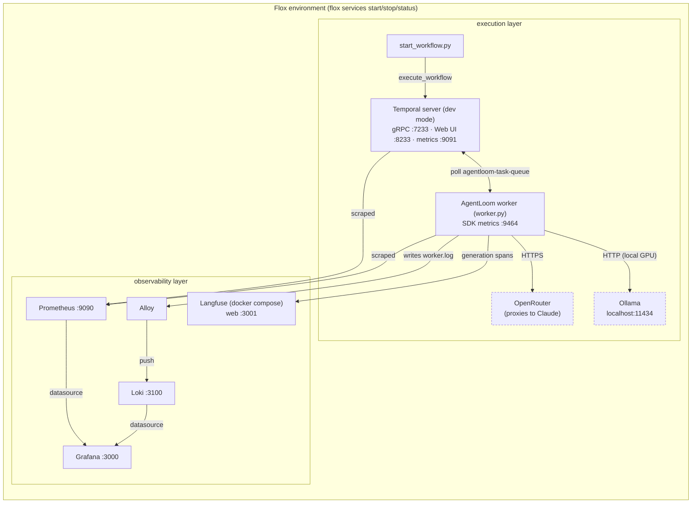

# Architecture

AgentLoom has two layers: an **execution layer** (Temporal + the worker, which
actually runs the agents) and an **observability layer** (Prometheus, Grafana,
Langfuse, which let you see what the execution layer did). [Flox](https://flox.dev)
ties both layers together as a single set of local services.

## Components

Only one of **OpenRouter** or **Ollama** is active at a time — selected by
`LLM_BASE_URL`/`LLM_MODEL` in `.env` (see
[docs/services/activities.md](services/activities.md)). Everything else in
the diagram runs regardless of which LLM backend is configured.

## Request flow, step by step

1. `start_workflow.py` connects to Temporal (`localhost:7233`) and calls
   `client.execute_workflow(LoomWorkflow.run, topic, ...)`, which appends a
   `WorkflowExecutionStarted` event to a new workflow history and blocks
   waiting for the result.
2. Temporal server places a task on `agentloom-task-queue`. The worker
   (long-polling that queue) picks it up and runs `LoomWorkflow.run` inside
   its **workflow sandbox** — deterministic Python, no I/O allowed directly.
3. The workflow calls `workflow.execute_activity(openai_responses.create, ...)`
   for each agent step. This is scheduled as a durable, retryable unit of
   work; Temporal records the *decision* to run it in workflow history before
   the worker executes it.
4. The worker executes the **activity** (`activities/openai_responses.py`) —
   this is where non-deterministic, real-world work happens: an HTTP call to
   an OpenAI-compatible chat completions API — OpenRouter (which proxies to
   Claude) by default, or a local model server like Ollama when
   `LLM_BASE_URL` is set — wrapped in a Langfuse `generation` span tagged
   with the workflow ID (so every agent step of one run shows up as a single
   trace).
5. The activity's return value is recorded in workflow history. If the worker
   crashes before this point, Temporal simply reschedules the activity when a
   worker reconnects — no special recovery code needed.
6. Two researcher activities run concurrently via `asyncio.gather`; their
   results feed the writer activity, whose output feeds the critic activity.
   Each step is a separate, independently retryable activity — see
   [docs/services/workflows.md](services/workflows.md).
7. The final result flows back through workflow history to the blocked
   `execute_workflow` call in `start_workflow.py`, which prints it.
8. Throughout, the worker's Temporal SDK metrics (activity latencies, retry
   counts, task-queue backlog, etc.) are exposed on `:9464` and the Temporal
   server's internal metrics on `:9091`. Prometheus scrapes both every 10s;
   Grafana renders them via the pre-provisioned dashboards. In parallel, the
   worker's own log lines are written to a file that Alloy tails and pushes
   into Loki, so they're searchable in Grafana too (see
   [docs/services/loki.md](services/loki.md)).

## Why this design

- **Determinism boundary.** Workflow code (`workflows/*.py`) must be
  deterministic — no network calls, no `httpx`, no randomness without
  Temporal's helpers. All non-deterministic work (the actual LLM call) lives
  in an *activity* (`activities/openai_responses.py`), which runs outside the
  sandbox. This is why the workflow files import the activity module inside
  `workflow.unsafe.imports_passed_through()` — otherwise loading `httpx`/
  `langfuse` at workflow-definition time would fail the sandbox's import
  checks.
- **Retries owned by Temporal, not the LLM SDK.** The activity does not retry
  internally; a failed HTTP call raises, and Temporal's activity retry policy
  (exponential backoff, configurable via `execute_activity`) handles it. This
  means retry behavior is visible and controllable from one place (the
  workflow definition / Temporal UI), not buried in client library config.
- **One generic activity, many agents.** Every agent — researcher, writer,
  critic — calls the same `openai_responses.create` activity with different
  `instructions`. The pipeline's *shape* (fan-out, sequencing) lives entirely
  in workflow code, so adding an agent is a workflow-level change, not a new
  activity.
- **Tracing follows the workflow, not the process.** Because Temporal can
  retry an activity on any worker, "one trace per run" can't be built from
  process-local state. The activity instead derives Langfuse's `session_id`
  from `activity.info().workflow_id`, so every attempt of every activity in a
  given workflow run lands in the same Langfuse trace regardless of which
  worker process executed it.
- **Everything reproducible from one manifest.** All five services are
  declared in `.flox/env/manifest.toml` rather than in ad hoc shell scripts
  or READMEs-as-documentation, so `flox services start` is the single source
  of truth for "how do I run this locally." See
  [docs/services/flox.md](services/flox.md).

## Related docs

- [docs/e2e-testing.md](e2e-testing.md) — spin everything up and run a full test
- [docs/services/temporal.md](services/temporal.md)
- [docs/services/worker.md](services/worker.md)
- [docs/services/activities.md](services/activities.md)
- [docs/services/workflows.md](services/workflows.md)
- [docs/services/prometheus.md](services/prometheus.md)
- [docs/services/grafana.md](services/grafana.md)
- [docs/services/loki.md](services/loki.md)
- [docs/services/langfuse.md](services/langfuse.md)
- [docs/services/flox.md](services/flox.md)
